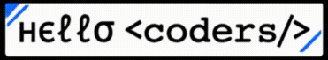

  
  

---

## 🚀 Languages

---

## ⚙️ Technologies & Tools

### Frontend

### Backend

### Databases

### Tools & Platforms

---

## 💻 Featured Projects

  
> **SkillBoost** is an AI-powered Learning Management System built using the MERN stack, featuring intelligent course discovery and personalized learning support.

  
> **CryptoVision** is a real-time cryptocurrency tracking application built with **React**, integrating live market data via the **CoinGecko API**.

  
> Personal developer portfolio showcasing projects, skills, and experience.

---

<h2 align="left">👨🏻‍💻 About Me:</h2>

- 💻 I'm a Fullstack Developer, currently building **Web & AI-powered applications**
- ⏳ Exploring **MERN Stack, Firebase, and AI/ML integration**
- 🚀 Always ready to collaborate on exciting projects and hackathons
- 👨‍🎓 Final-year IT Engineering Student at **Mumbai University**
- 🎯 Life Hack: "Code, Learn, Build, Repeat"
- 🏆 Developed projects like **Skill Boost**, **Crypto  Vision**, and **Medical Diagnosis Assistant**
- ⚡ Fun fact: I love exploring  **PC building**, and experimenting with new tech tools
 

 <a href="https://github.com/tejas978"> 
  &nbsp;&nbsp;  
 </a> 

  

**Code Cycle** 

&nbsp;&nbsp;&nbsp;&nbsp;&nbsp;

&nbsp;&nbsp;&nbsp;&nbsp;&nbsp;
 

<!--img src="https://github.com/SP-XD/SP-XD/blob/main/images/this_page_is.gif?raw=true"  width="40%"/-->

